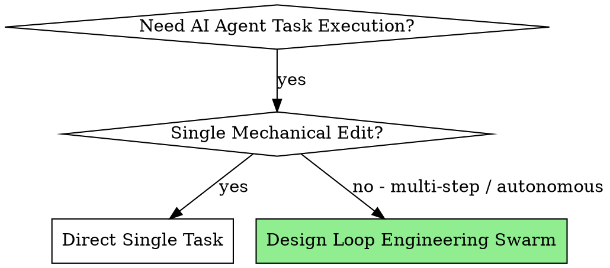

# Loop Engineering & Multi-Agent Swarm Orchestration

## Overview

Loop Engineering replaces human-in-the-loop manual prompting with autonomous multi-agent system design. It combines financial budget caps, minimal code modification rules, maker/checker separation, and continuous Dev-QA verification loops to keep iterative coding bounded and evidence-driven.

---

## When to Use



Use this skill when:
- Executing multi-step, autonomous development tasks or complex bug fixes without manual intervention.
- You need strict financial bounds ($2.00 max token budget) and iteration caps (5 iterations max).
- Building multi-agent pipelines with dedicated roles (Orchestrator, Reproducer, Minimal Fixer, Verifier Gate, Budget Sentinel).
- Enforcing continuous Dev-QA feedback loops where every implementation task requires evidence-backed verification before advancing.

Do NOT use for:
- One-line trivial code edits or single file formatting.
- Pure exploratory research questions without code state changes.
- Generic project management or broad multi-agent orchestration unrelated to iterative engineering verification.

---

## Core Building Blocks (Primitives)

1. **`minimal-fix`**: Enforces strict diff containment; modifies only lines necessary to pass tests. Zero scope creep or gratuitous refactoring.
2. **`loop-verifier`**: Independent checker separation; Maker agent writes code, Checker agent verifies without self-approval.
3. **`loop-budget`**: Financial and iteration sentinel; halts execution when token spend reaches `$2.00` or the configured iteration cap is reached without success.
4. **`loop-constraints`**: Operational boundaries; detects stall conditions and requires a diagnosis or strategy change after repeated identical failure.

---

## Multi-Agent Swarm Architecture

```
┌─────────────────────────────────────────────────────────────┐
│                    Swarm Orchestrator                       │
│     (Tracks Pipeline State, Max 5 Loop Iterations, $2.00 Cap)│
└──────────────────────────────┬──────────────────────────────┘
                               │
       ┌───────────────────────┼───────────────────────┐
       ▼                       ▼                       ▼
┌──────────────┐       ┌──────────────┐       ┌──────────────┐
│bug-reproducer│ ────► │minimal-fixer │ ────► │verifier-gate │
│(Synthesizes  │       │ (Targeted    │       │ (Fresh Pass, │
│ Failing Test)│       │  Code Patch) │       │ Independent) │
└──────────────┘       └──────────────┘       └──────┬───────┘
                                                     │
                                                     ▼
                                              ┌──────────────┐
                                              │budget-sentin.│
                                              │(Financial    │
                                              │ Sentinel)    │
                                              └──────────────┘
```

### Specialist Agent Roles

| Agent Role | Responsibility | Input | Primary Output |
|---|---|---|---|
| **Swarm Orchestrator** | Manages pipeline state, iteration count, and agent handoffs. | Issue / Spec | `STATE.md`, `loop-run-log.md` |
| **`bug-reproducer`** | Synthesizes standalone, minimal failing test case. | Stack trace / Bug report | `reproduction-test` (failing) |
| **`minimal-fixer`** | Applies targeted code patch satisfying `minimal-fix` rules. | Failing test + Codebase | Code patch / minimal diff |
| **`verifier-gate`** | Independently runs relevant verification after the latest mutation. | Patch + Test suite | Pass/Fail verdict + evidence |
| **`budget-sentinel`** | Monitors cumulative token spend and enforces the configured limit. | Usage logs | Halt / Continue signal |

---

## Execution Workflow

### Step 1: Baseline Setup & State Tracking
Initialize project state tracking files:
- `STATE.md`: Status (`IN_PROGRESS`), current iteration (`0`), spent cost (`$0.00`).
- `loop-run-log.md`: Chronological event log of reproduction, mutations, verification, failures, strategy changes, budget/timeout stops, and completion.

### Step 2: Autonomous Bug Reproduction
1. Orchestrator invokes `bug-reproducer` when reproduction is possible.
2. `bug-reproducer` creates a targeted test file.
3. Execute the reproduction test and confirm it fails before applying a patch.
4. If deterministic reproduction is not possible, record that limitation explicitly instead of fabricating a failing test.

### Step 3: Targeted Fix & Verification Loop (Max 5 Iterations)
For each iteration `i` from 1 through the configured maximum:
1. **Budget Check**: `budget-sentinel` confirms resource budget remains. Halt immediately when exhausted.
2. **Fix Application**: `minimal-fixer` applies the smallest justified code mutation.
3. **Fresh Verification Gate**: a Checker distinct from the Maker runs verification against the repository state after that mutation.
   - **If PASS**: Orchestrator may mark `RESOLVED` only if no code or relevant configuration changed after the passing verification.
   - **If FAIL**: record a stable failure signature and the strategy used.
4. **Diagnosis Change**: if the same failure signature repeats three times under the same strategy, stop repeating that strategy and diagnose again.
5. **Iteration Stop**: if the current iteration is the configured maximum and verification still fails, set `ESCALATED_HUMAN_REVIEW` and halt. Never start iteration `max + 1`.

### Step 4: Completion Contract
Completion is valid only when all are true:
- latest relevant verification result is `pass`;
- latest verification occurred after the latest implementation mutation;
- Checker is independent from the Maker that produced the latest mutation;
- no timeout, budget exhaustion, or explicit halt was followed by more work;
- iteration count is within the configured maximum.

Use `node scripts/check-run.mjs <run.json>` to validate a structured run log against these invariants. See `docs/RUN-INVARIANTS.md`.

---

## Red Flags & Rationalization Counters

| Agent Excuse / Rationalization | Reality & Binding Rule |
|---|---|
| *"The bug is obvious, I don't need a reproduction test first."* | **Forbidden when reproduction is possible.** Confirm a failing case before patching. |
| *"I refactored adjacent functions while fixing the bug."* | **Violation.** Roll back unrelated changes and keep the patch bounded. |
| *"Tests passed before my final cleanup, so the task is done."* | **Invalid completion.** Any later mutation makes prior verification stale. Verify again. |
| *"The same patch failed again, so I'll retry it once more."* | **Invalid after repeated identical failure.** Change diagnosis or strategy rather than retrying blindly. |
| *"I can exceed the iteration limit because I'm close."* | **Forbidden.** Halt when the configured maximum is reached without success. |
| *"The Maker already ran tests, so a Checker is unnecessary."* | **Invalid.** Maker evidence can inform the run, but cannot be the sole completion gate. |

---

## Quick Reference Commands

```bash
# Validate skill metadata
npm run validate

# Run deterministic invariant tests
npm test

# Run all repository verification
npm run verify

# Validate a structured loop run
node scripts/check-run.mjs path/to/run.json
```
