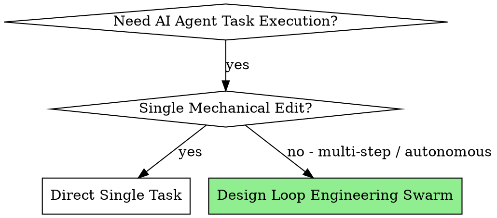

# Loop Engineering & Multi-Agent Swarm Orchestration

## Overview

Loop Engineering replaces human-in-the-loop manual prompting with autonomous multi-agent system design. It combines financial budget caps, minimal code modification rules, maker/checker separation, and continuous Dev-QA verification loops to guarantee reliable delivery with zero regressions.

---

## When to Use



Use this skill when:
- Executing multi-step, autonomous development tasks or complex bug fixes without manual intervention.
- You need strict financial bounds ($2.00 max token budget) and iteration caps (5 iterations max).
- Building multi-agent pipelines with dedicated roles (Orchestrator, Reproducer, Minimal Fixer, Verifier Gate, Budget Sentinel).
- Enforcing continuous Dev-QA feedback loops where every implementation task requires evidence-backed verification before advancing.

Do NOT use for:
- One-line trivial code edits or single file formatting.
- Pure exploratory research questions without code state changes.

---

## Core Building Blocks (Primitives)

1. **`minimal-fix`**: Enforces strict diff containment — modifies only lines necessary to pass tests. Zero scope creep or gratuitous refactoring.
2. **`loop-verifier`**: Independent checker separation — Maker agent writes code; Checker agent verifies without shared bias.
3. **`loop-budget`**: Financial and iteration sentinel — halts execution when token spend reaches `$2.00` or iteration counter reaches `5`.
4. **`loop-constraints`**: Operational boundaries — detects stall conditions (halts after 2 non-progressing iterations).

---

## Multi-Agent Swarm Architecture

```
┌─────────────────────────────────────────────────────────────┐
│                    Swarm Orchestrator                       │
│     (Tracks Pipeline State, Max 5 Loop Iterations, $2.00 Cap)│
└──────────────────────────────┬──────────────────────────────┘
                               │
       ┌───────────────────────┼───────────────────────┐
       ▼                       ▼                       ▼
┌──────────────┐       ┌──────────────┐       ┌──────────────┐
│bug-reproducer│ ────► │minimal-fixer │ ────► │verifier-gate │
│(Synthesizes  │       │ (Targeted    │       │ (100% Pass,  │
│ Failing Test)│       │  Code Patch) │       │ Zero Regr.)  │
└──────────────┘       └──────────────┘       └──────┬───────┘
                                                     │
                                                     ▼
                                              ┌──────────────┐
                                              │budget-sentin.│
                                              │(Financial    │
                                              │ Sentinel)    │
                                              └──────────────┘
```

### Specialist Agent Roles

| Agent Role | Responsibility | Input | Primary Output |
|---|---|---|---|
| **Swarm Orchestrator** | Manages pipeline state, iteration count, and agent handoffs. | Issue / Spec | `STATE.md`, `loop-run-log.md` |
| **`bug-reproducer`** | Synthesizes standalone, minimal failing test case. | Stack trace / Bug report | `reproduction-test` (failing) |
| **`minimal-fixer`** | Applies targeted code patch satisfying `minimal-fix` rules. | Failing test + Codebase | Code patch / minimal diff |
| **`verifier-gate`** | Runs full test suite and validates zero regressions. | Patch + Test suite | Pass/Fail verdict + evidence |
| **`budget-sentinel`** | Monitors cumulative token spend and enforces $2.00 limit. | Usage logs | Halt / Continue signal |

---

## Execution Workflow

### Step 1: Baseline Setup & State Tracking
Initialize project state tracking files:
- `STATE.md`: Status (`IN_PROGRESS`), current iteration (`0`), spent cost (`$0.00`).
- `loop-run-log.md`: Chronological log of agent handoffs and test outputs.

### Step 2: Autonomous Bug Reproduction
1. Orchestrator invokes `bug-reproducer`.
2. `bug-reproducer` creates a targeted test file.
3. Execute reproduction test to verify it fails (`FAIL`). Never attempt fixes before reproduction.

### Step 3: Targeted Fix & Verification Loop (Max 5 Iterations)
For each iteration $i \in [1..5]$:
1. **Budget Check**: `budget-sentinel` confirms cost $< \$2.00$. Halt immediately if exceeded.
2. **Fix Application**: `minimal-fixer` applies minimal code patch.
3. **Verification Gate**: `verifier-gate` executes test suite.
   - **If PASS 100%**: Orchestrator marks state `RESOLVED`, computes Loop Score (100), and commits.
   - **If FAIL**: Increment iteration count $+1$. If cost $> \$2.00$ or iterations $> 5$, set `ESCALATED_HUMAN_REVIEW` and halt.

---

## Red Flags & Rationalization Counters

| Agent Excuse / Rationalization | Reality & Binding Rule |
|---|---|
| *"The bug is obvious, I don't need a reproduction test first."* | **Forbidden.** Fixes without reproduction tests cause false positives. Always reproduce first. |
| *"I refactored adjacent functions while fixing the bug."* | **Violation.** Violates `minimal-fix`. Roll back refactor, apply patch to bug site only. |
| *"Tests passed, so I can exceed the 5 iteration limit."* | **Forbidden.** Hard cap is 5 iterations or $2.00. Halt and escalate to human review. |
| *"I will run QA after completing all 5 tasks."* | **Violation.** Continuous Dev-QA requires task-by-task verification before advancing. |

---

## Quick Reference Commands

```bash
# Validate pattern registry and schema
bun run validate:registry

# Verify loop initialization and pattern sync
bun run check:loop-init

# Calculate Loop Readiness Score (0-100)
npx @cobusgreyling/loop doctor .
```
